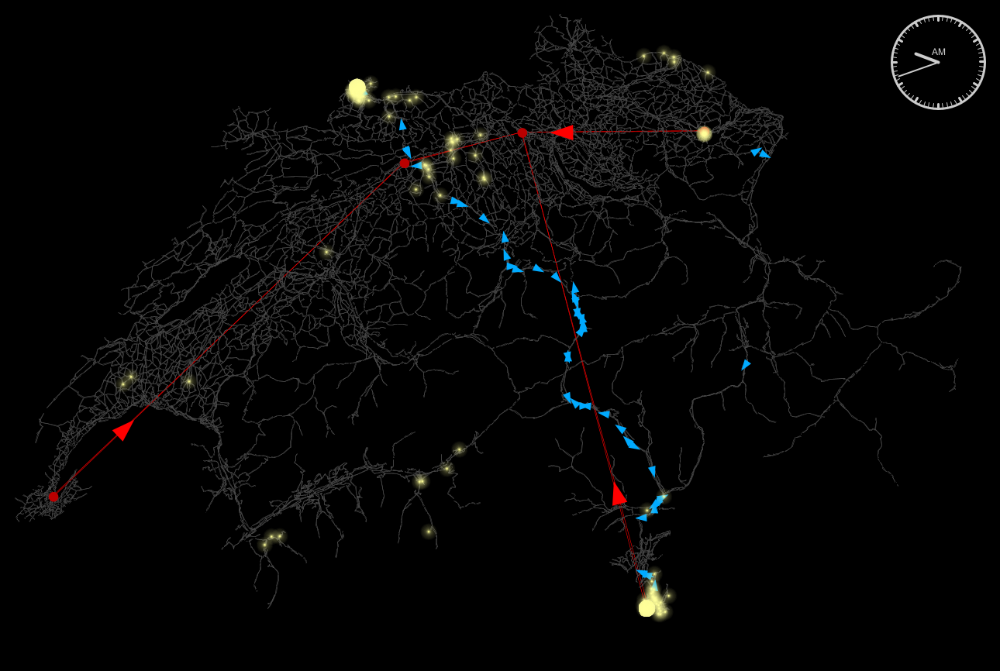

# MATSim Switzerland Freight Scenario



### About this project

This repository provides a model for Switzerland's inland freight transport developed by Swiss Federal Railways (Schweizerische Bundesbahnen, SBB), Corporate Development.
Developers/Contributors: Annick Noll, Merlin Unterfinger, Thomas Hettinger, David Masson, Ihab Kaddoura

<a rel="SBB" href="www.sbb.ch"></a>

----

### Model features

* The current version of the model accounts for two modes of transportation: (1) The road only mode and (2) intermodal road and rail transport (combined transport, in German: kombinierter Verkehr, short: KV).
* Each container is modeled as an individual agent which follows a cost minimization approach.
* The transport supply consists of the road network, the cargo train schedule and the intermodal terminals.
* The simulation accounts for dynamic queuing at terminals by modeling a (1) train-stack queue and a (2) truck-stack queue. Furthermore, trains have a maximum loading capacity.
* The repository also provides functionality to prepare your own scenario and generate the required input files to run a simulation.

----

### Prepare input data and run the model

- In `scenarios/` some example input files are provided which may be used to run an illustrative Switzerland case study.
- Run `ch.sbb.intermodalfreight.RunExample.java` to process these input files and to generate the required MATSim input files and to run the simulation.

----

### Structure

The project root directory has to follow this structure:

```txt
.
├── 01_original_data
│   └── ...
├── 02_processed_data
│   ├── d001
│   │   ├── version.json
│   │   └── ...
│   └── ...
├── 03_matsim_input
│   ├── v001
│   │   ├── version.json
│   │   └── ...
│   └── ...
├── 04_matsim_output
│   ├── r001
│   └── ...
├── 05_analysis_results
│   ├── r001
│   └── ...
└── 06_docs
```

The processed data is labeled with a `d` prefix for versioning, simulation inputs are identified with a `v` prefix, and
simulation runs and analysis outputs are denoted by an `r` prefix.
